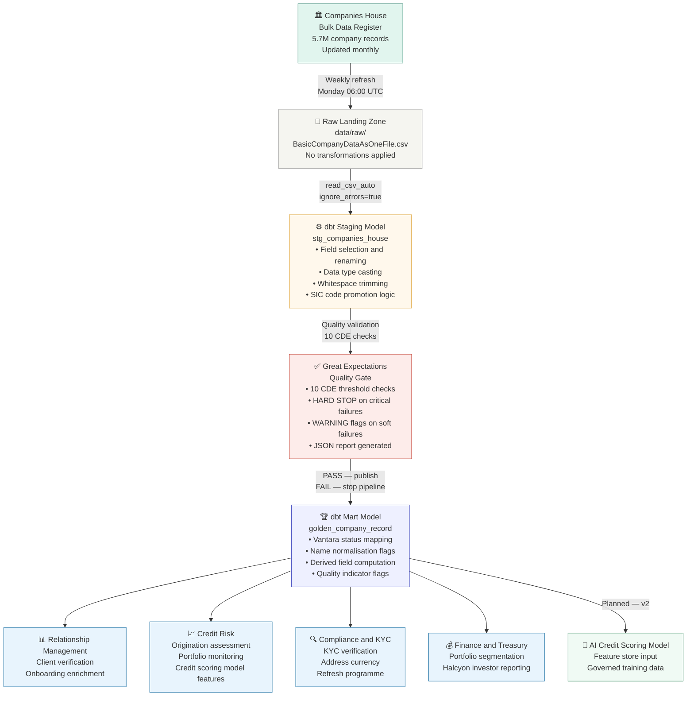

# Vantara Company Data Product — Pipeline Lineage

## End-to-End Data Flow

## Quality Scorecard — Latest Run (2026-10-01)

| CDE | Check | Threshold | Actual | Status |
|---|---|---|---|---|
| CDE 1 | Company Number — Completeness | 100% | 100% | 🟢 PASS |
| CDE 1 | Company Number — Uniqueness | 100% | 100% | 🟢 PASS |
| CDE 2 | Registered Name — Completeness | 100% | 100% | 🟢 PASS |
| CDE 3 | Company Status — No Unmapped Values | 100% | 99.95% | 🔴 FAIL |
| CDE 4 | Registered Address — PostCode | 95% | 98.4% | 🟢 PASS |
| CDE 4 | Registered Address — AddressLine1 | 98% | 98.9% | 🟢 PASS |
| CDE 5 | SIC Code — Completeness | 90% | 100% | 🟢 PASS |
| CDE 6 | Incorporation Date — Completeness | 100% | 100% | 🟢 PASS |
| CDE 7 | Last Accounts Date — Completeness | 85% | 91.8% | 🟢 PASS |
| CDE 8 | Confirmation Statement Date | 85% | 81.7% | 🟡 WARN |

## Key Findings

**2,612 UNMAPPED status values** — Companies House 
returned status codes not in the agreed Vantara 
mapping table. Steward review required to extend 
the mapping before these records can be published.

**18.3% of active companies have no confirmation 
statement date** — meaning they cannot be classified 
as ACTIVELY MAINTAINED under the agreed Vantara 
definition. This is a known Companies House data 
characteristic for certain company types.

**SIC promotion logic worked perfectly** — zero 
UNKNOWN SIC codes despite Companies House having 
gaps in SicText_1. The fallback to SicText_2, 3, 
and 4 resolved every gap.

## Technology Stack

| Layer | Tool |
|---|---|
| Source | Companies House Bulk Data (free, public) |
| Database | DuckDB |
| Transformation | dbt Core 1.12.5 |
| Quality | Custom Python quality suite |
| Version Control | Git + GitHub |